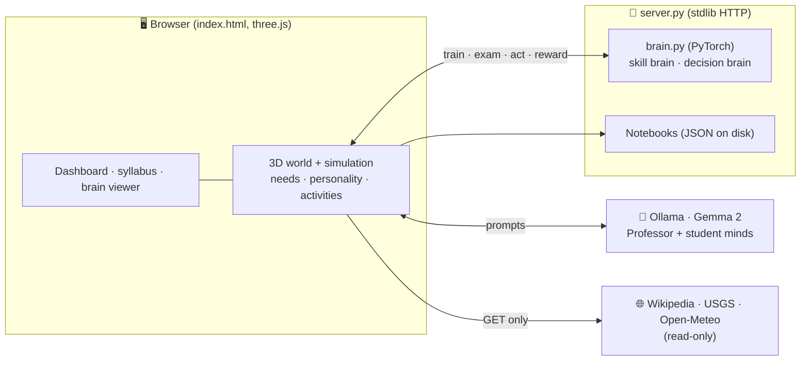

<div align="center">

# 🌍 AI World

### A living 3D world where tiny neural networks go to school, make their own choices, search the internet, and invent things.

**You watch every neuron learn.** A local LLM acts as their professor.


</div>

---

## ✨ What is this?

AI World is a teaching toy and a research playground in one. Ten small AI "students" live on a low-poly planet with a school, university, research institute, library, exam hall, dormitory, internet lab and park. Nobody tells them what to do.

- 🧠 **Real neural networks you can read.** Each student has a *skill brain* (a few dozen connections, trained with backpropagation in **PyTorch**) and a *decision brain* that learns what to do next from the world's rewards (**REINFORCE**, a policy-gradient method). Click a student and watch its weights, neuron activity and its map of guesses change as it learns.
- 🎲 **Free will.** Students have needs (energy, fun, friends), personalities and learned likes. They choose whether to study, sleep, play, explore, take exams, go online or invent puzzles. Click one to see *why* it chose what it did.
- 🌐 **Real internet, read-only.** In the Internet Lab they pick their own topics, search Wikipedia, read, write notes in their own notebook and are quizzed on those notes. They also test their own hypotheses on real USGS earthquake and Open-Meteo weather data.
- 🎓 **Professor Gemma.** A local LLM ([Gemma 2](https://ai.google.dev/gemma), through [Ollama](https://ollama.com)) mentors stuck students, studies Wikipedia in its free time, keeps a notebook of which tips actually helped, and lends each student a "Gemma mind" that can invent new input features as maths formulas (validated by a safe formula parser before use).
- 📜 **A syllabus you can read.** A fixed classroom curriculum (lines, circles, XOR, spirals…) plus an *open curriculum* that records whatever the students freely choose to learn.
- 🌅 **Looks good on integrated graphics.** Day/night cycle, atmosphere, real shadows when you look inside a building, and automatic resolution scaling that keeps it near 60 fps on Intel iGPUs.

<div align="center">


</div>

## 🚀 Quick start (Windows)

You need **Python 3.10+**, **[Ollama](https://ollama.com/download)** and a modern browser (Edge or Chrome).

```bash
git clone https://github.com/andrewsavio/AI-World.git
cd AI-World
pip install -r requirements.txt
start-world.bat            # or: start-world-background.bat  (tray icon, keeps running)
```

The first run downloads Gemma 2 (2B, about 1.6 GB) through Ollama. Then open **http://localhost:8000** (it opens automatically).

> **No Ollama or no PyTorch?** The world still runs. Without PyTorch the students use built-in JavaScript brains. Without Ollama there is no Professor and no free-text learning, but the maths curriculum and the real-data experiments work.
>
> **macOS / Linux:** `python server.py` does everything except the `.bat` helpers. Run `ollama pull gemma2:2b && ollama cp gemma2:2b aiworld-gemma` once.

### Controls
| Action | How |
|---|---|
| Rotate / zoom | drag / scroll |
| Look inside a building | click it, or use the buttons under the 3D view |
| Read a student's mind | click the student, or its row in the table |
| 📜 Syllabus · 📊 Dashboard | header buttons |
| Quality | `Auto` (recommended), `High`, `Low` menu in the 3D view |
| Stop everything | ⏹ **Stop world** button, or the tray icon in background mode |

## 🧩 How it works



| Layer | Technology | Role |
|---|---|---|
| Skill brain | **PyTorch** MLP, autograd, mini-batch SGD | learns to separate blue and red dots; can grow neurons and gain senses |
| Decision brain | **PyTorch** MLP + **REINFORCE** | learns a correction to the built-in instincts from reward |
| Student/Professor minds | **Gemma 2 2B** via Ollama | choose topics, write notes, set exams, invent senses |
| Memory | JSON notebooks + keyword retrieval (RAG) | what each student knows (60-note cap = forgetting) |
| World | **three.js**, instancing, merged meshes, canvas textures | 3D town, avatars, day/night |
| Server | Python `http.server` (keep-alive, Origin checks) | serves the page, hosts the brains, saves notebooks |

Everything runs on your machine. No cloud, no API keys.

## 🗂️ Repository layout

```
index.html              the whole front end: 3D world, simulation, UI (one file, ES modules from a CDN)
brain.py                PyTorch brains + safe formula parser. `python brain.py` runs the self-test
server.py               HTTP server: static files, /brain/* and /policy/* API, notebooks, shutdown
launcher.py             tray-icon launcher (Open dashboard / Stop world)
export_dataset.py       turns the students' notes and quizzes into fine-tuning data (JSONL)
models/Modelfile        how Ollama should load the bundled Gemma weights (optional)
start-world*.bat        Windows helpers
docs/screenshots/       images used in this README
```

## 🧪 Testing

```bash
python brain.py          # self-test: learning, growing, formula parser (rejects non-maths), reward learning
```

There is no test framework yet. Adding one is a great first contribution (see below).

## 🤝 Contributing

Contributions of every size are welcome, from fixing a typo to adding a whole new kind of student. See **[CONTRIBUTING.md](CONTRIBUTING.md)** for setup, conventions and the review checklist.

**Good first issues**
- 🧪 Add `pytest` tests for `brain.py` (parser edge cases, grow/add-sense, policy learning)
- 💾 Save and load the students' network weights so they survive a restart
- 🔎 Replace keyword retrieval with embeddings (`nomic-embed-text` via Ollama) and measure the difference
- 🍎 macOS/Linux launcher scripts (`start-world.sh`)
- ♿ Keyboard navigation and screen-reader labels for the dashboard

**Bigger ideas**
- 🖥️ Headless mode: run the simulation on the server so the world lives 24/7 with no browser open
- 🔬 LoRA fine-tuning of Gemma on `export_dataset.py` output, then compare exam scores before and after
- 🧬 Replace the blue/red-dot tasks with richer environments (grid worlds, simple games)
- 📈 Log every experiment to CSV and add plots (does the Gemma mind really save lessons?)
- 🗣️ Student-to-student teaching and conversation

## 🛡️ Safety notes

- The students' internet access is **read-only on purpose**: HTTPS GET requests to Wikipedia, USGS and Open-Meteo. They never post, sign up, send messages or buy anything, and nothing about you is sent.
- Text from the internet and from the LLM is shown as plain text (escaped), never as HTML.
- Invented formulas go through a small parser that understands only numbers, `x y r a pi`, arithmetic and a short list of maths functions. It never calls `eval`.
- The server listens on `127.0.0.1` only, and write requests are accepted only from the world's own page (Origin check).

## 🙏 Credits

- Built by **[Andrew Savio](https://github.com/andrewsavio)**.
- [three.js](https://threejs.org), [PyTorch](https://pytorch.org), [Ollama](https://ollama.com), Wikipedia, [USGS](https://earthquake.usgs.gov), [Open-Meteo](https://open-meteo.com).
- **Gemma** is a model by Google, used under the [Gemma Terms of Use](models/GEMMA_TERMS.txt). The model weights are *not* part of this repository.

## 📄 License

Code: [MIT](LICENSE). Gemma weights are governed by Google's Gemma Terms of Use.
