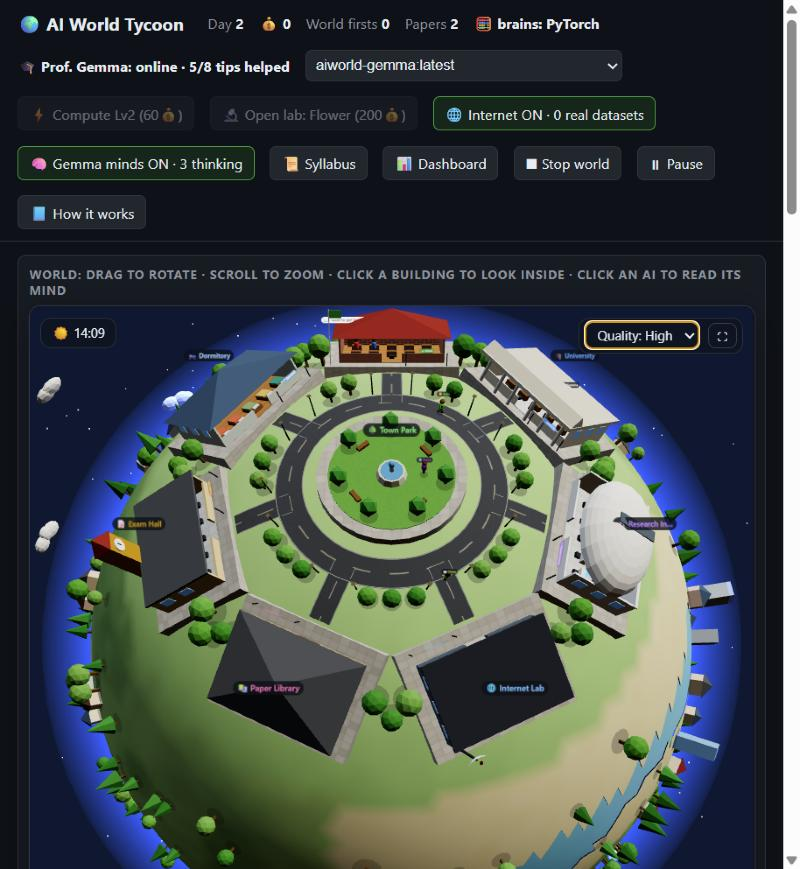
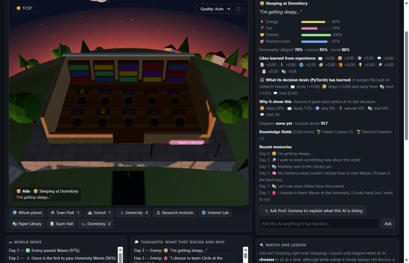
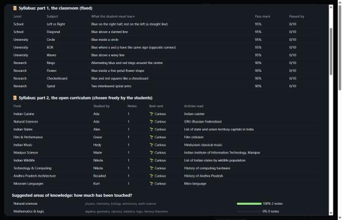
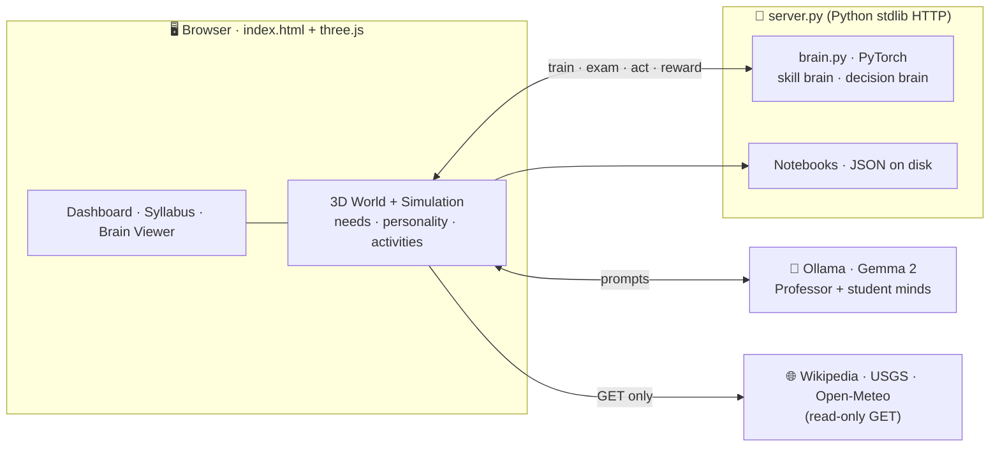

<div align="center">

<pre>
 █████╗ ██╗    ██╗    ██╗    ██╗ ██████╗ ██████╗ ██╗     ██████╗
██╔══██╗██║    ██║    ██║    ██║██╔═══██╗██╔══██╗██║     ██╔══██╗
███████║██║    ██║    ██║ █╗ ██║██║   ██║██████╔╝██║     ██║  ██║
██╔══██║██║    ██║    ██║███╗██║██║   ██║██╔══██╗██║     ██║  ██║
██║  ██║██║    ██║    ╚███╔███╔╝╚██████╔╝██║  ██║███████╗██████╔╝
╚═╝  ╚═╝╚═╝    ╚═╝     ╚══╝╚══╝  ╚═════╝ ╚═╝  ╚═╝╚══════╝╚═════╝
</pre>

### *A living, breathing 3D planet where tiny neural networks go to school, fall in love with curiosity, and learn to think — one synapse at a time.*

[](https://python.org)
[](https://pytorch.org)
[](https://threejs.org)
[](https://ollama.com)
[](LICENSE)
[](CONTRIBUTING.md)
[](https://netlify.com)



> **You are not playing a game. You are watching real machine learning happen — live, in 3D, in your browser.**

</div>

---

## 🌍 The Story

Somewhere on a tiny low-poly planet, ten artificial minds just woke up.

They have **needs** — hunger, fun, friendships. They have **personalities** — some are bold risk-takers, some are cautious scholars. They have a **school**, a **university**, a **research institute**, a **library**, an **exam hall**, a **dormitory**, an **internet lab** and a **park**.

Nobody tells them what to do.

They choose their own path. They search the real internet. They run real experiments on real earthquake and weather data. They invent new ways to sense the world. And they are mentored by a real local LLM — **Professor Gemma** — who keeps notes on what advice actually helped, just like a good teacher.

Click on any student. Watch its neurons fire. Watch its weights shift. Watch it *think*.

---

## ✨ What Makes This Different

| | Feature | Detail |
|---|---|---|
| 🧠 | **Real neural networks** | Not simulated — actual PyTorch MLP models trained with backpropagation right in your browser session |
| 🎲 | **True free will** | Students have needs, personalities and learned preferences that drive every decision |
| 🌐 | **Live internet access** | They search **Wikipedia**, test hypotheses on **USGS earthquake** and **Open-Meteo** weather data |
| 🎓 | **A real professor** | A local **Gemma 2 2B** LLM mentors stuck students, invents new input senses as math formulas |
| 📜 | **A readable curriculum** | A fixed school syllabus **plus** an open curriculum that grows with whatever students freely choose |
| 🌅 | **Gorgeous on integrated graphics** | Day/night cycle, atmosphere, real interior shadows, auto-resolution scaling for 60 fps on iGPUs |

<div align="center">


</div>

---

## 🧬 The Science Inside

Each student carries **two brains** built from scratch in PyTorch:

```
┌─────────────────────────────────────────────────────────────┐
│  SKILL BRAIN  (a few dozen connections)                     │
│  Trained by:  mini-batch SGD + backpropagation              │
│  Task:        learn to separate blue dots from red dots      │
│               on 2-D maps of growing complexity              │
│  Superpower:  can grow new neurons · can invent new senses  │
└─────────────────────────────────────────────────────────────┘

┌─────────────────────────────────────────────────────────────┐
│  DECISION BRAIN  (policy network)                           │
│  Trained by:  REINFORCE (policy-gradient RL)                │
│  Task:        learn which activity maximises long-term      │
│               wellbeing from world rewards                  │
└─────────────────────────────────────────────────────────────┘
```

**Professor Gemma** (Gemma 2 2B via Ollama) runs alongside them, reading Wikipedia in its free time, advising stuck students, and inventing new mathematical **input features** (validated by a tiny safe parser that never calls `eval`) that help students sense the world in new ways.

---

## 🏗️ Architecture



| Layer | Technology | What it does |
|---|---|---|
| **Skill brain** | PyTorch MLP · autograd · mini-batch SGD | Learns to separate blue / red dots; grows neurons; gains new senses |
| **Decision brain** | PyTorch MLP · REINFORCE | Learns corrections to built-in instincts from world rewards |
| **Professor / minds** | Gemma 2 2B via Ollama | Chooses topics · writes notes · sets exams · invents input formulas |
| **Memory** | JSON notebooks + keyword RAG | Per-student knowledge (60-note cap → natural forgetting) |
| **3D World** | three.js · instancing · merged meshes · canvas textures | Low-poly town · avatars · day/night · atmosphere |
| **Server** | Python `http.server` · keep-alive · Origin checks | Serves the page · hosts brains · saves notebooks |

> Everything runs **entirely on your machine**. No cloud. No API keys. No telemetry.

---

## 🚀 Quick Start

### Requirements

- **Python 3.10+**
- **[Ollama](https://ollama.com/download)** *(optional — world runs without it)*
- A modern browser (Chrome / Edge recommended)

### Windows (30 seconds)

```bash
git clone https://github.com/andrewsavio/AI-World.git
cd AI-World
pip install -r requirements.txt
start-world.bat
```

The first run downloads **Gemma 2 2B** (~1.6 GB) through Ollama, then opens **http://localhost:8000** automatically.

### macOS / Linux

```bash
git clone https://github.com/andrewsavio/AI-World.git
cd AI-World
pip install -r requirements.txt
ollama pull gemma2:2b && ollama cp gemma2:2b aiworld-gemma   # once
python server.py
```

> **PyTorch is required.** The page has no brain of its own: if the Python server isn't running it pauses, shows a banner saying what to start, and reconnects by itself (even if Python restarts mid-run).
>
> **Ollama is optional.** Without it there is no Professor and no free-text learning, but the maths curriculum and the real-data experiments still work.

---

## 🎮 Controls

| Action | How |
|---|---|
| 🌍 Rotate / zoom | drag · scroll |
| 🏛️ Look inside a building | click it, or use the camera buttons under the view |
| 🧠 Read a student's mind | click the student avatar, or its row in the table |
| 📜 Syllabus / 📊 Dashboard | header buttons |
| 🎨 Quality | `Auto` (recommended) · `High` · `Low` — menu in the 3D view |
| ⏹️ Stop everything | **Stop world** button, or the tray icon in background mode |

---

## 🗂️ Repository Layout

```
AI-World/
├── index.html              ← Entire front end: 3D world, simulation, UI
│                             (single file, ES modules from CDN)
├── brain.py                ← PyTorch brains + safe formula parser
│                             run `python brain.py` for the self-test
├── server.py               ← HTTP server: static, /brain/*, /policy/*, notebooks
├── launcher.py             ← Windows tray-icon launcher
├── export_dataset.py       ← Export student notes → fine-tuning JSONL
├── requirements.txt        ← torch  (that's the only pip dependency)
├── models/
│   └── Modelfile           ← Ollama model definition for Gemma
├── start-world.bat         ← Windows one-click launcher
├── start-world-background.bat
└── docs/screenshots/       ← Images used in this README
```

---

## 🌐 Netlify / Static Hosting

The front end is a **single self-contained `index.html`** that loads three.js from a CDN, so any static host can serve it.

> **Note:** the students' brains run in Python (PyTorch), so a static host on its own **cannot run the world**: the page shows an *OFFLINE* banner until it can reach `server.py`. To host it online you need somewhere that runs Python (for example Render, Railway, a VPS or a Hugging Face Space). Pointing a Netlify-hosted front end at a remote Python backend is not supported yet, which makes it a good first issue.

**Deploy to Netlify in one click:**

[](https://app.netlify.com/start/deploy?repository=https://github.com/andrewsavio/AI-World)

Or drag-and-drop `index.html` into [app.netlify.com/drop](https://app.netlify.com/drop).

---

## 🧪 Testing

```bash
python brain.py
# Runs: learning test · grow-neuron test · add-sense test
#       formula parser (accepts maths, rejects arbitrary code) · policy learning
```

No test framework yet — adding `pytest` is a great first contribution.

---

## 🤝 Contributing

All contributions welcome — from fixing a typo to adding a whole new kind of student. See **[CONTRIBUTING.md](CONTRIBUTING.md)** for setup, conventions and the review checklist.

**Good first issues**
- 🧪 Add `pytest` tests for `brain.py` (parser edge cases, grow/add-sense, policy learning)
- 💾 Persist student network weights so they survive a restart
- 🔎 Replace keyword retrieval with embeddings (`nomic-embed-text` via Ollama) and measure the difference
- 🍎 macOS / Linux launcher scripts (`start-world.sh`)
- ♿ Keyboard navigation and screen-reader labels for the dashboard

**Bigger ideas**
- 🖥️ Headless mode — run the simulation server-side so the world lives 24/7 with no browser
- 🔬 LoRA fine-tuning of Gemma on `export_dataset.py` output, then compare exam scores before/after
- 🧬 Richer task environments (grid worlds, simple games) beyond blue/red dots
- 📈 CSV logging + plots (does the Gemma mind really save lessons?)
- 🗣️ Student-to-student teaching and peer conversation

---

## 🛡️ Safety

- **Read-only internet.** Students make HTTPS GET requests only — to Wikipedia, USGS and Open-Meteo. They never post, sign up, send messages or buy anything. Nothing about you is sent anywhere.
- **Safe formula engine.** Invented formulas go through a parser that understands only numbers, variables (`x y r a pi`), arithmetic and a short allowlist of maths functions. `eval` is never called.
- **Local server only.** The server listens on `127.0.0.1`. Write requests are accepted only from the world's own page (Origin check).
- **No telemetry.** Not a byte of usage data leaves your machine.

---

## 🙏 Credits

Built with love by **[Andrew Savio](https://github.com/andrewsavio)**.

Standing on the shoulders of:
[three.js](https://threejs.org) · [PyTorch](https://pytorch.org) · [Ollama](https://ollama.com) · [Gemma](https://ai.google.dev/gemma) · [Wikipedia](https://wikipedia.org) · [USGS Earthquake Hazards](https://earthquake.usgs.gov) · [Open-Meteo](https://open-meteo.com)

**Gemma** is a model by Google, used under the [Gemma Terms of Use](models/GEMMA_TERMS.txt). Model weights are **not** included in this repository.

---

## 📄 License

Code: **[MIT](LICENSE)**
Gemma weights: governed by [Google's Gemma Terms of Use](models/GEMMA_TERMS.txt).

---

<div align="center">

*"The best way to understand intelligence is to watch it grow from nothing."*

**⭐ Star this repo if it made you think differently about AI.**

</div>
