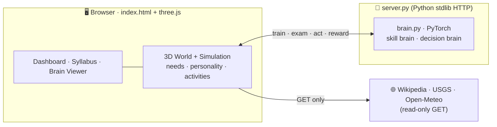

<div align="center">

<pre>
 █████╗ ██╗    ██╗    ██╗    ██╗ ██████╗ ██████╗ ██╗     ██████╗
██╔══██╗██║    ██║    ██║    ██║██╔═══██╗██╔══██╗██║     ██╔══██╗
███████║██║    ██║    ██║ █╗ ██║██║   ██║██████╔╝██║     ██║  ██║
██╔══██║██║    ██║    ██║███╗██║██║   ██║██╔══██╗██║     ██║  ██║
██║  ██║██║    ██║    ╚███╔███╔╝╚██████╔╝██║  ██║███████╗██████╔╝
╚═╝  ╚═╝╚═╝    ╚═╝     ╚══╝╚══╝  ╚═════╝ ╚═╝  ╚═╝╚══════╝╚═════╝
</pre>

### *A living, breathing 3D planet where tiny neural networks go to school, fall in love with curiosity, and learn to think — one synapse at a time.*

[](https://python.org)
[](https://pytorch.org)
[](https://threejs.org)
[](LICENSE)
[](CONTRIBUTING.md)
[](https://netlify.com)


> **You are not playing a game. You are watching real machine learning happen — live, in 3D, in your browser.**

</div>

---

## 🌍 The Story

Somewhere on a tiny low-poly planet, ten artificial minds just woke up.

They have **needs** — hunger, fun, friendships. They have **personalities** — some are bold risk-takers, some are cautious scholars. They have a **school**, a **university**, a **research institute**, a **library**, an **exam hall**, a **dormitory**, an **internet lab** and a **park**.

Nobody tells them what to do.

They choose their own path. They search the real internet. They run real experiments on real earthquake and weather data. They create new puzzles and discover new ways to sense the world. And every one of them has two real neural networks that you can watch learn.

Click on any student. Watch its neurons fire. Watch its weights shift. Watch it *think*.

---

## ✨ What Makes This Different

| | Feature | Detail |
|---|---|---|
| 🧠 | **Real neural networks** | Not simulated — actual PyTorch MLP models trained with backpropagation while you watch |
| 🎲 | **True free will** | Students have needs, personalities and learned preferences that drive every decision |
| 🌐 | **Live internet access** | They look up real places on **Wikipedia** and test their own hypotheses on **USGS earthquake** and **Open-Meteo** weather data |
| 📜 | **A seven-level syllabus** | Students are **promoted** level by level, from straight lines to creating new puzzles ([details](docs/SYLLABUS.md)) |
| 🌅 | **Gorgeous on integrated graphics** | Day/night cycle, atmosphere, real interior shadows, auto-resolution scaling for 60 fps on iGPUs |

<div align="center">


</div>

---

## 🧬 The Science Inside

Each student carries **two brains** built from scratch in PyTorch:

```
┌─────────────────────────────────────────────────────────────┐
│  SKILL BRAIN  (a few dozen connections)                     │
│  Trained by:  mini-batch SGD + backpropagation              │
│  Task:        learn to separate blue dots from red dots      │
│               on 2-D maps of growing complexity              │
│  Superpower:  can grow new neurons · can discover new senses│
└─────────────────────────────────────────────────────────────┘

┌─────────────────────────────────────────────────────────────┐
│  DECISION BRAIN  (policy network)                           │
│  Trained by:  REINFORCE (policy-gradient RL)                │
│  Task:        learn which activity maximises long-term      │
│               wellbeing from world rewards                  │
└─────────────────────────────────────────────────────────────┘
```

There is no language model anywhere: every decision and every lesson comes from these small networks and the world's rewards. A student that gets stuck can grow neurons, read a paper another student published in the Library, or discover a new input **sense** (like x², radius or angle) and publish it for the others.

---

## 🏗️ Architecture



| Layer | Technology | What it does |
|---|---|---|
| **Skill brain** | PyTorch MLP · autograd · mini-batch SGD | Learns to separate blue / red dots; grows neurons; gains new senses |
| **Decision brain** | PyTorch MLP · REINFORCE | Learns corrections to built-in instincts from world rewards |
| **3D World** | three.js · instancing · merged meshes · canvas textures | Low-poly town · avatars · day/night · atmosphere |
| **Server** | Python `http.server` · keep-alive · Origin checks | Serves the page · hosts the brains |

> Everything runs **entirely on your machine**. No cloud. No API keys. No telemetry.

---

## 🚀 Quick Start

### Requirements

- **Python 3.10+**
- A modern browser (Chrome / Edge recommended)

### Windows (30 seconds)

```bash
git clone https://github.com/andrewsavio/AI-World.git
cd AI-World
pip install -r requirements.txt
start-world.bat
```

It opens **http://localhost:8000** automatically.

### macOS / Linux

```bash
git clone https://github.com/andrewsavio/AI-World.git
cd AI-World
pip install -r requirements.txt
python server.py
```

> **PyTorch is required.** The page has no brain of its own: if the Python server isn't running it pauses, shows a banner saying what to start, and reconnects by itself (even if Python restarts mid-run).

---

## 🎮 Controls

| Action | How |
|---|---|
| 🌍 Rotate / zoom | drag · scroll |
| 🏛️ Look inside a building | click it, or use the camera buttons under the view |
| 🧠 Read a student's mind | click the student avatar, or its row in the table |
| 📜 Syllabus / 📊 Dashboard | header buttons |
| 🎨 Quality | `Auto` (recommended) · `High` · `Low` — menu in the 3D view |
| ⏹️ Stop everything | **Stop world** button, or the tray icon in background mode |

---

## 🗂️ Repository Layout

```
AI-World/
├── index.html              ← Entire front end: 3D world, simulation, UI
│                             (single file, ES modules from CDN)
├── brain.py                ← PyTorch brains (skill brain + decision brain)
│                             run `python brain.py` for the self-test
├── server.py               ← HTTP server: static files, /brain/*, /policy/*
├── launcher.py             ← Windows tray-icon launcher
├── requirements.txt        ← torch  (that's the only pip dependency)
├── start-world.bat         ← Windows one-click launcher
├── start-world-background.bat
└── docs/screenshots/       ← Images used in this README
```

---

## 🌐 Netlify / Static Hosting

The front end is a **single self-contained `index.html`** that loads three.js from a CDN, so any static host can serve it.

> **Note:** the students' brains run in Python (PyTorch), so a static host on its own **cannot run the world**: the page shows an *OFFLINE* banner until it can reach `server.py`. To host it online you need somewhere that runs Python (for example Render, Railway, a VPS or a Hugging Face Space). Pointing a Netlify-hosted front end at a remote Python backend is not supported yet, which makes it a good first issue.

**Deploy to Netlify in one click:**

[](https://app.netlify.com/start/deploy?repository=https://github.com/andrewsavio/AI-World)

Or drag-and-drop `index.html` into [app.netlify.com/drop](https://app.netlify.com/drop).

**AI World is local-first.** The real world runs on your computer (`start-world.bat`). A hosted copy is only a *representation*: it shows an explanation instead of running. To make a hosted page talk to a Python server you run yourself, open it with `?api=https://your-server` and start that server with `AIWORLD_ORIGINS=https://your-site` (add `AIWORLD_HOST=0.0.0.0` if it must be reachable from other machines). There is one world per server, so it is meant for a single viewer.

---

## 📜 The syllabus

Students move up through **seven levels**. To be promoted, a student must pass every subject of its level and meet the extra requirement (if any). Then it advances to the next level, and so on.

| Level | Name | Subjects | Also needed |
|---|---|---|---|
| 1 | Foundations | Left vs Right · Top vs Bottom · Diagonal | |
| 2 | Shapes | Stripe · Circle · Diamond | |
| 3 | Curves & Logic | Ellipse · XOR · Waves | |
| 4 | Patterns | Rings · Checkerboard | pass a real-data subject |
| 5 | Mastery | Flower · Spiral | |
| 6 | Invention | | create a puzzle or discover a new sense |
| 7 | Open research | no gates | |

The order follows curriculum learning (easy before hard), the dataset order of TensorFlow Playground, UNESCO's education levels and Bloom's taxonomy. Read the reasoning and the references in **[docs/SYLLABUS.md](docs/SYLLABUS.md)**.

---

## 🧪 Testing

```bash
python brain.py
# Runs: learning test · grow-neuron test · add-sense test · policy (reward) learning
```

No test framework yet — adding `pytest` is a great first contribution.

---

## 🤝 Contributing

All contributions welcome — from fixing a typo to adding a whole new kind of student. See **[CONTRIBUTING.md](CONTRIBUTING.md)** for setup, conventions and the review checklist.

**Good first issues**
- 🧪 Add `pytest` tests for `brain.py` (grow / add-sense, policy learning)
- 💾 Persist student network weights so they survive a restart
- 🍎 macOS / Linux launcher scripts (`start-world.sh`)
- ♿ Keyboard navigation and screen-reader labels for the dashboard

**Bigger ideas**
- 🖥️ Headless mode — run the simulation server-side so the world lives 24/7 with no browser
- 📚 A text-knowledge track that needs no language model (extractive notes from Wikipedia plus fill-in-the-blank quizzes)
- 🧬 Richer task environments (grid worlds, simple games) beyond blue/red dots
- 📈 CSV logging + plots (does the decision brain really learn? how many lessons does each level take?)
- 🗣️ Student-to-student teaching and peer conversation

---

## 🛡️ Safety

- **Read-only internet.** Students make HTTPS GET requests only — to Wikipedia (to look up places), USGS and Open-Meteo. They never post, sign up, send messages or buy anything. Nothing about you is sent anywhere.
- **Local server only.** The server listens on `127.0.0.1`. Write requests are accepted only from the world's own page (Origin check).
- **No telemetry.** Not a byte of usage data leaves your machine.

---

## 🙏 Credits

Built with love by **[Andrew Savio](https://github.com/andrewsavio)**.

Standing on the shoulders of:
[three.js](https://threejs.org) · [PyTorch](https://pytorch.org) · [Wikipedia](https://wikipedia.org) · [USGS Earthquake Hazards](https://earthquake.usgs.gov) · [Open-Meteo](https://open-meteo.com)

---

## 📄 License

Code: **[MIT](LICENSE)**

---

<div align="center">

*"The best way to understand intelligence is to watch it grow from nothing."*

**⭐ Star this repo if it made you think differently about AI.**

</div>
